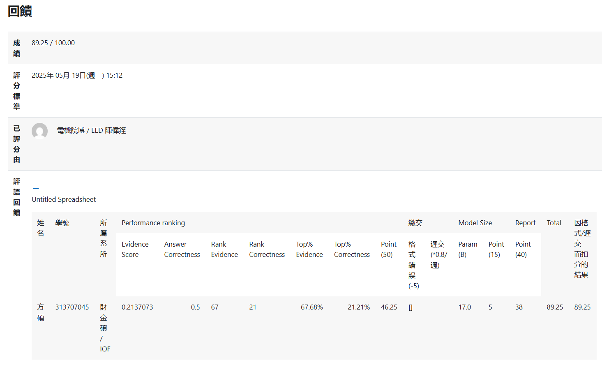

[RAG report](GAI_HW3_RAG/RAG.pdf)
# 0. 模型設定與前測

## 0.1 使用模型

使用的 LLM：`"meta-llama/llama-4-scout-17b-16e-instruct”` 

Pairwise LLM：`"gemma3” (Ollama)` 

## 0.2 前測分數

|  | evidence_score | correctness |
| --- | --- | --- |
| 0415_第一版 | 0.18595668749501 | 0.34 |
| 0421_第二版 | 0.180709243294114 | 0.39 |
| 0426_第三版 | 0.213707325247661 | 0.49 |

# 1. ⽅法與實驗設計

```python
[Full Text (文章原文)]
          |
          ▼
╔══════════════╗
║   Chunking   ║
╚══════════════╝
[Initial Splitting by "\n\n\n"]
          |
          ▼
[Recursive Chunking]
(chunk_size=256, chunk_overlap=128)
          |
          ▼
[Embedding Construction]
(using BGE-M3, normalize=True)
          |
          ▼
╔══════════════╗
║   Retrieval  ║
╚══════════════╝
[Dense Retriever]
(Top-32 Retrieval based on Cosine Similarity)
          |
          ▼
[Pointwise Reranker]
(Rescore and select Top-32 based on embedding similarity)
          |
          ▼
[Pairwise Reranker]
(Using small LLM to compare and select Top-16)
          |
          ▼
╔════════════════════╗
║ Prompt & Inference ║
╚════════════════════╝
[RAG Inference with CoT Prompt]
(Structured Answer Generation)

```

## 1.1. 檢索方法

### 1.1.1 Chunking策略

**1.1.1.1 初步分段**

```python
documents = full_text.split("\n\n\n")[:-1]
docs = [Document(page_content=doc) for doc in documents]
```

根據助教建議，用 `"\n\n\n"` 初步分段切分原文，把分章節間隔分開，比起硬性固定字數切分更能保持語意連貫性，避免切分掉重要資訊。

**1.1.1.2 進階 Chunking**

```python
text_splitter = RecursiveCharacterTextSplitter(
        chunk_size=256,
        chunk_overlap=128,
        length_function=len,
        add_start_index=True,
    )
    docs_splits = text_splitter.split_documents(docs)
```

- `chunk_size=256`：單個 chunk 大約256字元，確保每個chunk長度適中。
- `chunk_overlap=128`：每兩個相鄰 chunk 重疊128字元，保留跨段語境資訊。
- `length_function=len`：以字符長度衡量chunk長短（適合英文或符號型文本）。

有嘗試過 `chunk_size=128`、`chunk_overlap=64` ，但看回答狀況發現成效很不好，程式沒跑完我就直接砍掉了；因為有參考 public 檔案中的 evidence 長度，所以也不考慮把長度調成高 512。

**1.1.1.3 Embedding**

```python
model_name = "BAAI/bge-m3" #sentence-transformers/all-mpnet-base-v2"
encode_kwargs = {'normalize_embeddings': True}
embeddings = HuggingFaceEmbeddings(
					   model_name=model_name,
					   encode_kwargs=encode_kwargs
					  )
```

- `model_name = "BAAI/bge-m3"`：前兩次作業用 `sentence-transformers/all-mpnet-base-v2` ，第三次前測改用 huggingface 上看蠻多人使用的 `BAAI/bge-m3` 模型，correctnss 表現有顯著提升 (0.39 → 0.49)。
- `normalize_embeddings=True`：強制embedding向量L2正規化，保證後續餘弦相似度計算的合理性與穩定性。

### 1.1.2 Retrieve

**1.1.2.1 Dense Retriever**

```python
# Step 2: 檢索
vector_store = InMemoryVectorStore.from_documents(docs_splits, embeddings)
retriever = vector_store.as_retriever(search_kwargs={"k": RETRIEVE_TOP_K})
retrieved_docs = retriever.get_relevant_documents(question)
```

一開始只有用這個初步的 dense retriever，下面是兩次前測的 evidence score。

**1.1.2.2 加入 Pointwise Reranker、Pairwise Reranker**

```python
# Step 3: rerank
top_m_docs = rank_by_pointwise(question, retrieved_docs, embeddings, top_m=32)  #top_m=16
reranked_docs = rerank_by_pairwise(question, top_m_docs, llm_reranker, top_n=16)    #top_n=10
```

在 [PairDistill: Pairwise Relevance Distillation for Dense Retrieval](https://arxiv.org/abs/2410.01383) [1] 論文中看到這個先 dense retrieve 後再 Rerank 這個先寬後精的作法獲得靈感，rerank 加進來之後明顯 evidence score 大幅提高了約 3%。

本作業選擇使用輕量的 ollama 小型 model 進行 pairwise rerank，是在資源有限情況下達成效果最大化的策略，兼顧實作可行性與回答品質。


| 前測次數 | k | evidence_score |
| --- | --- | --- |
| 第一次 | 16 (dense) | 0.18595668749501 |
| 第二次 | 10 (dense) | 0.180709243294114 |
| 第三次 | 32 (dense) + 16 (pointwise) + 10 (pairwise) | 0.213707325247661 |

可以觀察到，從單純 dense retrieval（0.1807）到加上 Pointwise + Pairwise reranking（0.2137），在最後 evidence 都取 10 筆的情況下，evidence score 提升超過 3%，證明此策略有效提升 retrieval 相關性與推理正確率。

## 1.2 Prompt 技巧

### 1.2.1 Prompt 改進的過程

**第一版**

直接拿助教的版本來更改。

```python
"""Answer the question based on the context below.
If the question cannot be answered using the information provided answer
with \"I don't know\".

Context:
{context}

Question: {input}"""
```

**第二版**

看到論文 [2, 3] 中提到的方法，並發現助教給 LLM 的評分方式與其提到的技巧相似，因此將該評分提示放進 prompt 使用，但這邊的表現因為加入 CoT，且可能 prompt 太常導致所以回答並不精簡，比如第一題 public data 的回答：

`"To answer the question, let's analyze the provided context step by step.\n\nThe context mentions that the SemEval-2010 benchmark dataset BIBREF0 is composed of”` 

由於 output 限制在 80 tokens，完全沒回答到問題。

```python
"""You are an academic assistant that answers questions based on the provided paper context.

Using the context enclosed in triple backticks: ```{context}```,
answer the question enclosed in triple backticks: ```{input}```.

Think step-by-step to identify relevant evidence and reason through the answer.
Then produce a final concise response.

Your goal is to produce a concise, factual answer that would receive 
a perfect score according to the following grading logic:
1. The answer must directly and precisely respond to the question.
2. If the answer is a list, include **all and only** the correct items.
3. If the answer is a number, it must **match exactly or almost exactly**.
4. If the question asks about evaluation methods, clearly state:
- what is being compared
- what metric or method is used
5. Do not be vague, self-contradictory, or off-topic.
6. Do not speculate. Only use information grounded in the provided context.
7. If no relevant information exists in the context, reply: 
"No relevant context was provided."

Format requirements:
- First reason step-by-step internally.
- Then output only the final answer, limited to fewer than 80 tokens.
- Do not include your reasoning in the final output.

Answer:"""
```

**第三版**

改寫在台大陳蘊農教授[影片](https://www.youtube.com/watch?v=EI12E8bpsSE)中看到的指令。


```python
"""Give the answer to the question ```{input}``` 
using the information given in context delimited by triple backticks ```{context}```.

If there is no relevant information in the provided context, try to answer yourself, 
but tell user that you did not have any relevant context to base your answer on.

Be concise and output the answer of size less than 80 tokens.
assistant:
"""
```

因為測試需要，而 private data 不確定答案，較難比較是否正確，所以在判斷比較好的版本時我使用 public data 來做篩選，第一版回答完全無關，第二版的 prompt 有辨識出兩種 tasks，但仍沒有回答道重點，只有第三個 prompt 有答對，因此最後採用第三版的 prompt。

| **Prompt** | **My Predict Answer** |
| --- | --- |
| Ground Truth | `"text classification and text semantic matching”` |
| 第一版 | "Two typical tasks.” |
| 第二版 | "The context describes experiments on six datasets, and qualitative analysis of sentences to demonstrate model effectiveness.” |
| 第三版 | "The tasks that are experimented with are:\n\n1. **Text classification**\n2. Semantic matching \n\nMore specifically, the experiments involve:\n\n* Five text classification tasks\n* One semantic matching task\n* Two typical NLP tasks (which include **text classification and text semantic matching**)\n\nThese tasks are used to evaluate the effectiveness of the proposed” |

這邊改進的方式我有參考幾篇論文，以下是論文方式中提及且我有採用的技巧：

| 技巧名稱 | 實作內容 | 改進效果 |
| --- | --- | --- |
| Selective Context Use / Context Grounding [2] | `If there is no relevant information in the provided context, try to answer yourself, but tell user that you did not have any relevant context to base your answer on.` | 一開始第一版設定若模型不知道則回答 `I don't know`，但可能因為 temperature 需要讓回答精準而設低，output answer 裡有一堆 `I don't know`，改成這個指令後好很多。 |
| Structured Format Answer Generation [3] | `Be concise and output the answer of size less than 80 tokens.` | 有效回答到重點，如上方第二版答案到第三版的進步。 |

### 1.2.2 Pairwise Prompt

我的 pairwise prompt 參考論文 Large Language Models are Effective Text Rankers with Pairwise Ranking Prompting [4] 提到的 template  方式：

```python
"""
Given a query:
{query}

Which of the following two passages is more relevant to the query?

Passage A:
{docs[i].page_content}

Passage B:
{docs[j].page_content}

Output Passage A or Passage B:
"""
```

此處直接參考論文 [4] Pairwise Ranking Prompting 的 Template，因第三次前測效果很好，因此沒有再作調整，論文中使用的 template 如下：


## 1.3 前測表現

|  | evidence score | correctness |
| --- | --- | --- |
| 第一次 | 0.18595668749501 | 0.34 |
| 第二次 | 0.180709243294114 | 0.39 |
| 第三次 | 0.213707325247661 | 0.49 |

# 2. 亮點及優勢

## 2.1 Rerank

使用 pointwise 及 pairwise rerank，提升檢索的 evidence，在使用完 dense retriever ****後，先進行 pointwise 初步過濾，再以 pairwise 精緻的比較 evidence 重要程度，逐步提升 evidence 精準度。

此次作業選擇使用輕量的 ollama 小型 model 進行 pairwise rerank，是盡量在資源有限情況下達成效果最大化的策略，兼顧實作可行性與回答品質。然因 pairwise 需要大量運算資源，所以最後的 k 不能設太大，若資源充足，希望能把 k 設為 16 或更大，相信 evidence score 會有更好的表現。

## 2.2 Prompt

本作業在 Prompt 設計上，從基本指令到結合 CoT 與格式控制，經過多次迭代優化，最終有效提升了回答的正確率與精確性。

在第二個版本中加入了 Selective Context Use / Context Grounding 的方式，希望限制生成的答案內容、降低 hallucination 現象，但結果過於嚴苛；後面第三版嘗試引導 LLM 使用 Chain-of-Thought (CoT) 推理答案，成功提升了較複雜推理問題的穩定性與正確性。

同時，為符合作業評分標準，後面進一步導入了 Structured Format Answer Generation，也將平分判斷方式加入 prompt 中，要求模型輸出的答案必須具備高度精確性（數值、列表、方法名稱等必須與標準答案一致），且保持回答簡潔（小於80 tokens），期望能使模型生成的回應更易於評分且質量穩定。

而在 Pairwise Rerank 階段，Prompt 設計亦直接參考 Qin et al. (2023) [4] 所提出的 Pairwise Ranking Prompting 方法，使用文中 template 比對兩段 retrieved document 的相關性，進一步提升了 evidence quality，根據結果也有提升 evidence score 超過 3%。

## 2.3 整體亮點

本次作業從檢索到推理生成的完整流程中，針對各個關鍵環節進行了系統化的改進。

在 Retrieval 部分，結合 Dense Retriever、Pointwise Reranker 與 Pairwise Reranker 的先寬後精架構，成功提升了 evidence 的相關性與精確度。特別是在資源受限的條件下，選用輕量級 LLM 進行 Pairwise Ranking，有效平衡了運算效率與檢索品質，evidence score 相較初版提升超過 3%，顯示 reranking 流程的顯著優勢。

在 Inference 部分，將 Prompt 多次迭代調整，從基本指令逐步演進到結合論文 [2, 3] 中提到 Selective Context Use、Chain-of-Thought 推理、及 Structured Format Answer Generation 的設計。這些改進不僅有效控制 hallucination、避免過多 I don't know 地回復，也提升了模型在較複雜問題上的 inference 能力與 output 品質，成功在 correctness 上明顯成長。

而在作業中，方法改進有盡量搭配前測或自己的驗證做調整，包含不同版本的 Chunking、不同版本 Prompt、以及不同 Retriever 與 Reranker 設定，確保每一個優化步驟皆有實證支持，避免僅憑直覺調整。

最後，整體系統設計能夠清楚拆解並優化 chunking、embedding、retrieval、rrompt、inference 等各個子模組，使整體 RAG QA pipeline 的效能穩步提升，並透過合理的設計與實作證明，充分展現出我對 Retrieval-Augmented Generation 技術的理解與應用能力。

# 3. 待改進部分

- **evidence**
由於資源限制，沒有辦法嘗試更高的 k 值，希望未來如果有機會可以嘗試提高 k 值，或者依據題目動態調整 retrieve 的數量等方式，看能不能提升 evidence score。另外，也想嘗試不同的 chunking 策略，這次使用的比較少。
- **correctness**
正確率的部分還是沒有提升到 0.5 以上，是這次我比較遺憾的部分。我自己覺得可能跟 prompt 有關係。有些複雜可能需要加入 CoT，但我沒有嘗試出加入 CoT 時能兼顧精簡回答的 prompt。目前想到可以再嘗試的方向，可能是判斷不同問題類型，然後依據類別（分類、數值、列表）調整不同的 prompt，提升模型推理的能力。

# 4. 作業心得

我是大學畢業兩年後跨考至資管、資財的學生，大學時雖然讀 FinTech，但因當時期望的值涯方向比較偏財金，因此接觸科技的部分越來越少，且因當年 AI 沒有這麼熱門，沒有學過任何相關的課程，僅有的知識只有在考研時硬背下來生硬的觀念。上學期在修其他院的機器學習時，是我第一次接觸相關的 code，第一次 kaggle 作業時甚至連 dataloader 是什麼都不知道，所以在學習 AI 的內容時很惶恐，當時每一次 kaggle 幾乎都在倒數的名次，最後成績也很不理想。

這堂課前兩次的作業讓我越來越有信心，覺得自己其實是接觸時間不夠久，還沒有將觀念融會貫通，但也會懷疑自己是不是因為幸運，才能拿到還不錯的排名跟成績。

而這次作業是我第一次接觸 RAG，其實一開始對於能不能做好很擔心，在一開始學的時候也有很多疑惑跟困難，但在看完範例的 code、帥教授的課堂學習，和陳教授的影片後，逐漸理解 RAG 的每一個步驟，把每一個步驟 (Chunking、Retrieval、Prompt & Inference) 拆解開來看，就發現每一個部分都有可以調整、加強的地方。因此我開始依據不同部分上網查詢他人常用的方法 (如：huggingface 上最常被使用的 model) 或相關論文，廣泛的看有什麼新的方法、觀念可以融入近這次的 RAG 作業，很幸運的無論是 evidence 或 correctness 在每一次前測都有進步，也讓我逐漸相信自己吸收進來的觀念、知識是可以被妥善運用的。

人們常說：「研究所學習的是解決問題的能力」，AI 或甚至整個資訊領域的發展都十分快速，工具也日新月異地在更新，從上學期那個墊底、不知道如何開始寫機器學習相關 code 的自己，到現在可以上網看影片、查詢論文學習更多技巧，我期許自己可以更加如魚得水的有掌握、吸收新知，乃至運用所學的能力。

# 5. Reference

[1] Chia-Wei Huang and Yun-Nung Chen. 2024. PairDistill: Pairwise Relevance Distillation for Dense Retrieval. *arXiv preprint arXiv:2410.01383*.

[2] Wenqi Fan, Yujuan Ding, Liangbo Ning, Shijie Wang, Hengyun Li, Dawei Yin, Tat-Seng Chua, and Qing Li. 2024. A Survey on RAG Meeting LLMs: Towards Retrieval-Augmented Large Language Models. In *Proceedings of the 30th ACM SIGKDD Conference on Knowledge Discovery and Data Mining (KDD '24)*, Association for Computing Machinery, New York, NY, USA, 6491–6501. https://doi.org/10.1145/3637528.3671470.

[3] Bongsu Kang, Jundong Kim, Tae-Rim Yun, and Chang-Eop Kim. 2024. Prompt-RAG: Pioneering Vector Embedding-Free Retrieval-Augmented Generation in Niche Domains, Exemplified by Korean Medicine. *arXiv preprint arXiv:2401.11246*.
[[4]](https://arxiv.org/abs/2306.17563) Zhen Qin, Rolf Jagerman, Kai Hui, Honglei Zhuang, Junru Wu, Le Yan, Jiaming Shen, Tianqi Liu, Jialu Liu, Donald Metzler, et al. 2023. Large Language Models are Effective Text Rankers with Pairwise Ranking Prompting. *arXiv preprint arXiv:2306.17563*.

### 作業評分:
[](GAI_HW3_RAG/competetion_result.png)
