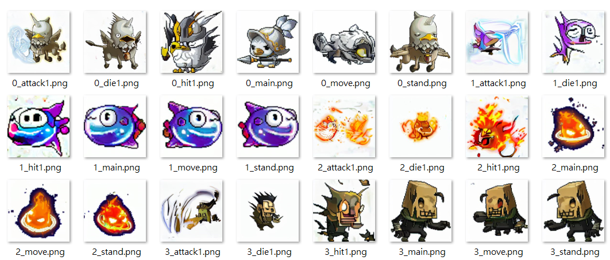
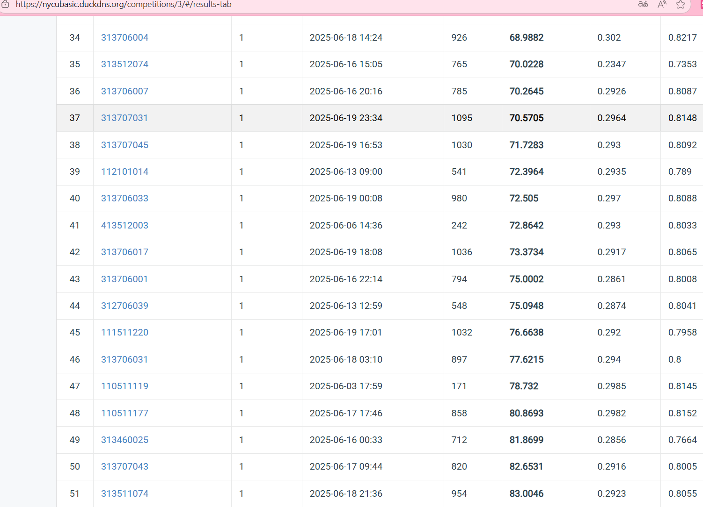

# 文字條件式圖像生成訓練程式

本專案為一個基於 [`Diffusers`](https://github.com/huggingface/diffusers) Text Conditional Duffsion Model，結合預訓練的 CLIP（文字編碼器）、VAE 以及 UNet 模型，訓練一個能根據 prompt 生成對應圖片的 Diffusion 模型。

## 使用方式

```
.
├── train.py              # 主訓練程式
├── train_info.json       # 包含圖片對應的描述資料
├── outputs/
│   ├── ckpt_last/        # 儲存模型 checkpoint
│   └── samples_last/     # 儲存每次生成圖片結果
```

---

## 建立環境


```bash
pip install -r requirements.txt
```

---

## 訓練方式

執行主訓練程式：

```bash
python train.py
```

若要接續某個 checkpoint 訓練，可以設定 `ckpt_path` 的路徑，會接續訓練。

### 訓練流程：

1. 載入預訓練模型：

   * `CLIPTextModel` CLIP（`openai/clip-vit-base-patch32`）
   * `AutoencoderKL` VAE（`CompVis/stable-diffusion-v1-4/vae`）
2. 初始化 UNet 模型架構
3. 訓練 UNet 預測加噪聲的 latent
4. 使用 bfloat16 混合精度（AMP）與 gradient accumulation steps 進行訓練
5. `eval_freq` 每 500 steps 會使用一些固定文字描述生成圖片做評估
6. `save_freq` 每 500 steps 儲存模型權重

### 預測圖像生成流程

當然可以，以下是針對你提供的 `generate.py`，用同樣格式整理的 **推論與圖片生成流程**：

---

## 🧪 推論與圖片生成流程

1. 載入預訓練模型：

   * `CLIPTextModel` CLIP（`openai/clip-vit-base-patch32`）
   * `AutoencoderKL` VAE（`CompVis/stable-diffusion-v1-4/vae`）

2. 載入訓練完成的 UNet 權重（`UNet2DConditionModel`），可設定 `stage` 參數選擇要生成的是根據哪個 step 的 checkpoint
3. 使用 `test.json` 讀取每筆測試資料中的 `text_prompt`
4. 建立 classifier-free guidance 條件與無條件的向量輸入
5. 使用 `DDIMScheduler` 進行 50 步 inference 還原 latent 圖像
6. 將還原後的 latent 經由 VAE 解碼並儲存為 `.png` 圖片於 `/outputs/ckpt_last/unet_{stage}`

---

## 模型架構自定義

UNet 架構：

```python
unet = UNet2DConditionModel(
        sample_size=32,
        in_channels=4,
        out_channels=4,
        block_out_channels=[256, 384, 512, 768],
        layers_per_block=2,
        down_block_types=[
            "CrossAttnDownBlock2D",
            "CrossAttnDownBlock2D",
            "CrossAttnDownBlock2D",
            "DownBlock2D"
        ],
        up_block_types=[
            "UpBlock2D",
            "CrossAttnUpBlock2D",
            "CrossAttnUpBlock2D",
            "CrossAttnUpBlock2D"
        ],
        cross_attention_dim=512,
        attention_head_dim=16
    ).to(device)
```

---

## 預訓練權重儲存格式

使用 `safetensors` 格式儲存於：

```
outputs/ckpt_last/unet_sch_XXXX/diffusion_pytorch_model.safetensors
```

## 資料夾結構
```
hw6_313707045.zip
├── public_data/
│   ├── sample_code/
│   │   ├── outputs/
│   │   │   ├── ckpt_last/           # 儲存模型之權重資料夾
│   │   │   │   ├──unet_sch_XXXXX    # 模型權重
│   │   │   ├── samples_last/        # 訓練測試生成圖片
│   │   ├── requirements.txt
│   │   ├── test.json                # 測試資料
│   │   ├── test.py                  # 圖片生成主程式
│   │   ├── train.py                 # 訓練主程式
│   ├── train/                       # 訓練用圖片資料夾
│   └── train_info.json              # 訓練圖像對應的文字描述
├── scoring_program/                 # 評分用程式
```

### Output 預覽:
[](https://github.com/313707045FangShuo/Generative_AI/blob/6fdee652c4c90a5877f49d10ba7c7b8c3134911f/GAI_HW6_conditional_DiffusionModel/result_preview.png)

### 作業排名: 37/100
[](https://github.com/313707045FangShuo/Generative_AI/blob/6fdee652c4c90a5877f49d10ba7c7b8c3134911f/GAI_HW6_conditional_DiffusionModel/competetion_result.png)
